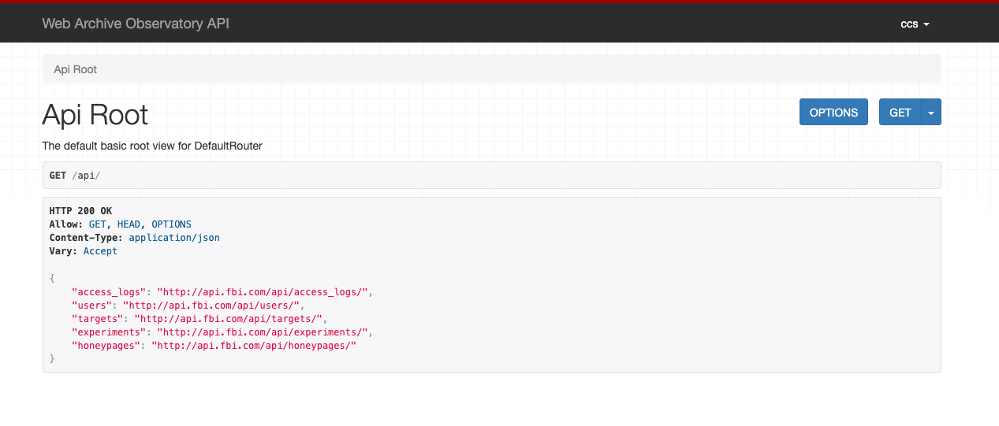
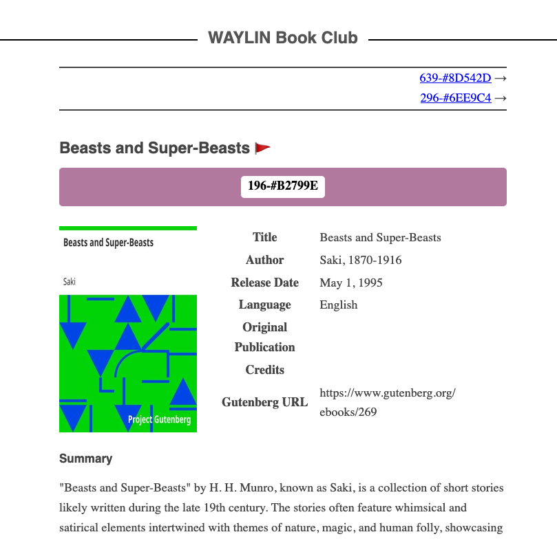

# Web Archive Observatory

This repository serves as an artifact for "The Power to Never Be Wrong: Evasions and Anachronistic Attacks Against Web Archives" CCS'25.

```txt
The Power to Never Be Wrong: Evasions and Anachronistic Attacks Against Web Archives
Robin Kirchner, Chris Tsoukaladelis, Martin Johns, and Nick Nikiforakis
Proc. of ACM Conference on Computer and Communications Security (CCS'25), 2025
```

```bibtex
@inproceedings{kirchner2025archiveintegrity,
    author    = {Robin Kirchner and Chris Tsoukaladelis and Martin Johns and Nick Nikiforakis},
    title     = {The Power to Never Be Wrong: Evasions and Anachronistic Attacks Against Web Archives},
    booktitle = {Proceedings of the ACM Conference on Computer and Communications Security (CCS)},
    year      = {2025}
}
```

### About this Readme
This README aims to simplify running the web archive observatory locally. The observatory requires a domain to function. For this demonstration, we serve the observatory at http://api.localhost/api/. All other subdomains, e.g., http://e840e7-649d6c.localhost/, resolve in a honeypage.

This README includes "▶ Tech Notes" for the interested reader.

### Artifact Claims
- This artifact provides the code for the web archive observatory that was used in the paper to gather meta information about archive crawlers. By following this readme, you will be able to launch the observatory on your local machine to inspect it via localhost.
- This artifact also provides visual proof of all attacks against web archive we presented in the main paper.

---

## Observatory Demonstration

The purpose of this setup is to run the web archive observatory (Section 3 of the paper) locally. 
For productive use, changes have to be made to host each observatory instance on a different domain. 
Note that we cannot offer support for that.

### Prerequisites (Docker)
First install the Docker Desktop including the Docker Engine and Docker Compose: https://docs.docker.com/engine/install/ubuntu/. 

### (Re-)Start

```sh
./scripts/restart.sh
```

> *▶ Tech Note:* Inspect the Docker logs via `docker logs -f observatory-artifact-backend-1`.

We seeded the database with a default user and some experiments.

```txt
username: ccs
password: 2025
```

> *▶ Tech Note:* The database file is located at ./run/dev.sqlite3.

### Visit the Browseable API

Visit [http://api.localhost/api/](http://api.localhost/api/) to visit your local instance of the observatory.
Go to Login in the top-right corner and put in the default credentials from above.

You can now use the browseable API to explore the observatory. 

| Name       | Meaning                                                                                                                                                                                                                                                              |
| ---------- | -------------------------------------------------------------------------------------------------------------------------------------------------------------------------------------------------------------------------------------------------------------------- |
| Target     | A target instance is a distinct web archive. Reuse the existing target or browse [http://api.localhost/api/targets/](http://api.localhost/api/targets/) to create one.                                                                                                   |
| Experiment | An experiment instance is one archiving experiment involving a honeypage (observatory webpage). Browse [http://api.localhost/api/experiments/](http://api.localhost/api/experiments/).                                                                                   |
| Honeypage  | A honeypage has a unique URL, like [http://e840e7-649d6c.localhost/](http://e840e7-649d6c.localhost/). Any request to it will be logged and information about the visitor are collected (e.g., TLS fingerprint). Honeypages are automatically created for an experiment. |


After visiting [http://api.localhost/api/](http://api.localhost/api/), you should see a website like this.


> *▶ Tech Note:*  Note that the URL pattern matches for the subdomain "api." and the exact path, e.g., "/api/" with trailing slash. Deviations from this pattern serve a honeypage. This is by design.

### Interact with Experiments

We created a Dummy Experiment for you at [http://api.localhost/api/experiments/e57ec339-c2cc-4522-b25d-c8cb4451c226/](http://api.localhost/api/experiments/e57ec339-c2cc-4522-b25d-c8cb4451c226/). You can visit this link to receive a JSON structure like this (shortened).

```json
{
    "url": "http://api.localhost/api/experiments/e57ec339-c2cc-4522-b25d-c8cb4451c226/",
    "id": "e57ec339-c2cc-4522-b25d-c8cb4451c226",
    "name": "Dummy Experiment",
    "target": "http://api.localhost/api/targets/c0920349-625c-4c26-8ac1-be45fd93e2c5/",
    "honeypage": "http://api.localhost/api/honeypages/df583290-b771-4078-94bb-456027e88a04/",
    "honeypage_link": "http://e840e7-649d6c.localhost/",
    "creator": "ccs",
    "created_at": "2025-08-27T05:03:18.862626-04:00",
    "access_logs": [],
    "target_name": "Dummy Target (Web Archive)"
}
```

It shows relations with target, creator (user), and the assigned honeypage. All of which can be explored with the browseable API.
Not that in a productive experiment, the `honeypage_link` must not be visited or shared. Here, you can freely visit the honeypage link [http://e840e7-649d6c.localhost/](http://e840e7-649d6c.localhost/).

You should see something like this:



This link is what an archiving experiment would archive via one of the archiving services.
Play around and visit the link in an Incognito Tab or clear your cookies. 
By the nature of our Honeypages, external visits are logged and meta data is saved for later analysis of archive crawlers.

> *▶ Tech Note:*  Requests to honeypage from an authenticated browser session are not recorded to reduce the amount of logging. You wont encounter this when using localhost, as in this demonstration.

### Inspect Access Logs

We seeded the database with the access logs from an unauthenticated visit to the Honeypage.


```json
"access_logs": [
    "http://api.localhost/api/access_logs/8ec1dc00-fcf0-4a75-ad07-ea57d0df97da/",
    "http://api.localhost/api/access_logs/31d161a1-29c4-4c55-8f7d-1f390a713faf/",
    "http://api.localhost/api/access_logs/8b59431c-4001-4a2e-a89a-154594c670db/",
    "http://api.localhost/api/access_logs/da7fc376-9f99-45e7-9cd2-0080a5fa8f86/",
    "http://api.localhost/api/access_logs/cb89d80d-5889-4168-adfd-e6427d79282a/",
    "http://api.localhost/api/access_logs/885a4d6d-726e-48ff-b06d-5f647ec1097b/",
    "http://api.localhost/api/access_logs/baa58693-38d7-4619-9d28-486e6b28d2a5/"
],
```

> *▶ Tech Note:* These are localhost to localhost logs for an HTTP visit, so no external IP address is logged. This demonstration runs without HTTPS, because that would require a TLS certificate that is passed to the TLS-fingerprinting proxy. Take a look at docker-compose.yml if you want to learn more about a productive setup. Naturally, TLS fingerprinting can only be done for HTTPS connections.

### (Optional) Create Another User

Superusers are created from the command line.

```sh
./scripts/create-admin.sh
```

Now follow the command line and choose a (simple) username and (simple) password for your local setup. Please remember these credentials.
You can leave the e-mail address empty. Repeat the password when asked.

### Stop

The stop-script shuts down the containers without deleting image, container, or volume.
(Delete those manually using the Docker CLI if you want to purge the system of this demonstration.)

```sh
./scripts/stop.sh
```

## Demonstration of Attacks against Web Archives

Our paper includes five classes of attacks against web archive snapshots.
We prepared recordings of each attack and uploaded them to Vimeo.
You can find the full video here: [https://vimeo.com/1073133312/a1ee430c28](https://vimeo.com/1073133312/a1ee430c28?autoplay=1).
Use the timestamped links below to conveniently jump to the respective part of the recording. 
Note that Archive Anachronisms are named Time Jump Attacks in the Video.

| Archive Name    | Archive Anachronism                                                          | Live-web Escape                                                             | CSP Stripping                                                               | Script Stripping                                                            | Server-side Evasion                                                         |
| --------------- | ---------------------------------------------------------------------------- | --------------------------------------------------------------------------- | --------------------------------------------------------------------------- | --------------------------------------------------------------------------- | --------------------------------------------------------------------------- |
| Wayback Machine | [✓](https://vimeo.com/1073133312/a1ee430c28?share=copy&autoplay=1#t=31m55s)  | [✓](https://vimeo.com/1073133312/a1ee430c28?share=copy&autoplay=1#t=6m44s)  | [✓](https://vimeo.com/1073133312/a1ee430c28?share=copy&autoplay=1#t=13m57s) | ╳                                                                           | [✓](https://vimeo.com/1073133312/a1ee430c28?share=copy&autoplay=1#t=21m23s) |
| Archive.Today   | ╳                                                                            | ╳                                                                           | [✓](https://vimeo.com/1073133312/a1ee430c28?share=copy&autoplay=1#t=7m55s)  | ╳                                                                           | [✓](https://vimeo.com/1073133312/a1ee430c28?share=copy&autoplay=1#t=16m10s) |
| Perma.cc        | ╳                                                                            | [✓](https://vimeo.com/1073133312/a1ee430c28?share=copy&autoplay=1#t=5m33s)  | [✓](https://vimeo.com/1073133312/a1ee430c28?share=copy&autoplay=1#t=13m15s) | ╳                                                                           | [✓](https://vimeo.com/1073133312/a1ee430c28?share=copy&autoplay=1#t=20m53s) |
| Megalodon       | [✓](https://vimeo.com/1073133312/a1ee430c28?share=copy&autoplay=1#t=30m20s)¹ | [✓](https://vimeo.com/1073133312/a1ee430c28?share=copy&autoplay=1#t=4m22s)¹ | [✓](https://vimeo.com/1073133312/a1ee430c28?share=copy&autoplay=1#t=12m36s) | ╳                                                                           | [✓](https://vimeo.com/1073133312/a1ee430c28?share=copy&autoplay=1#t=20m11s) |
| Ghost Archive   | [✓](https://vimeo.com/1073133312/a1ee430c28?share=copy&autoplay=1#t=28m25s)  | [✓](https://vimeo.com/1073133312/a1ee430c28?share=copy&autoplay=1#t=3m07s)  | [✓](https://vimeo.com/1073133312/a1ee430c28?share=copy&autoplay=1#t=10m56s) | ╳                                                                           | [✓](https://vimeo.com/1073133312/a1ee430c28?share=copy&autoplay=1#t=19m24s) |
| ARQUIVO         | [✓](https://vimeo.com/1073133312/a1ee430c28?share=copy&autoplay=1#t=24m31s)  | [✓](https://vimeo.com/1073133312/a1ee430c28?share=copy&autoplay=1#t=0m00s)  | [✓](https://vimeo.com/1073133312/a1ee430c28?share=copy&autoplay=1#t=35m30s) | ╳                                                                           | [✓](https://vimeo.com/1073133312/a1ee430c28?share=copy&autoplay=1#t=17m58s) |
| FreezePage      | ╳                                                                            | [✓](https://vimeo.com/1073133312/a1ee430c28?share=copy&autoplay=1#t=1m51s)  | [✓](https://vimeo.com/1073133312/a1ee430c28?share=copy&autoplay=1#t=10m14s) | [✓](https://vimeo.com/1073133312/a1ee430c28?share=copy&autoplay=1#t=15m48s) | [✓](https://vimeo.com/1073133312/a1ee430c28?share=copy&autoplay=1#t=19m00s) |
| Conifer         | [✓](https://vimeo.com/1073133312/a1ee430c28?share=copy&autoplay=1#t=26m49s)  | [✓](https://vimeo.com/1073133312/a1ee430c28?share=copy&autoplay=1#t=1m00s)  | [✓](https://vimeo.com/1073133312/a1ee430c28?share=copy&autoplay=1#t=9m45s)  | ╳                                                                           | [✓](https://vimeo.com/1073133312/a1ee430c28?share=copy&autoplay=1#t=18m33s) |


>¹ The attack works only in Megalodon’s “snapshot-only” mode.